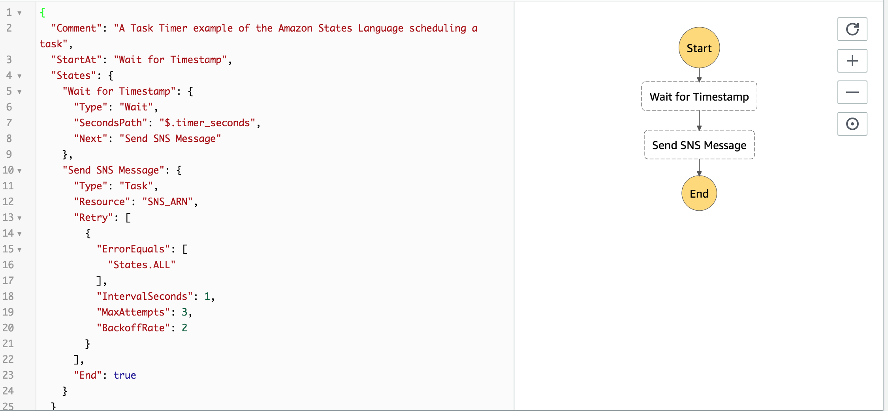
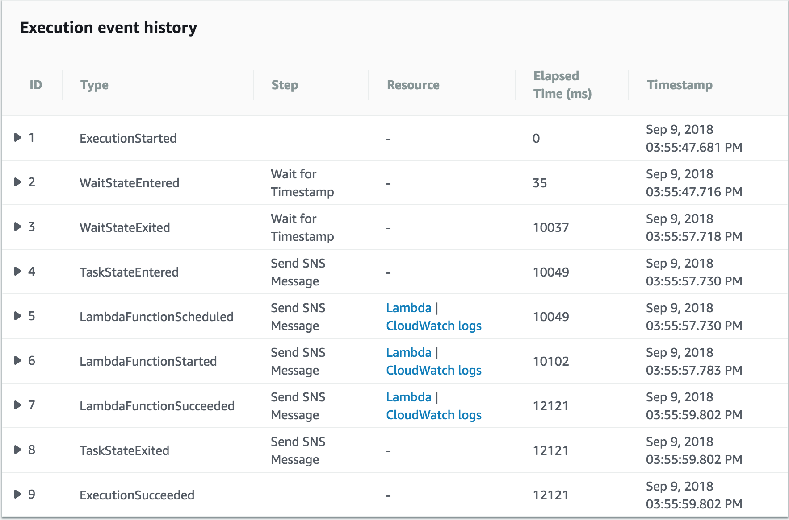

# AWS Step Functions

AWS Step Functions enable you to coordinate the components of distributed applications and microservices using visual workflows. Here I will inplement a simple example of `Task Timer` to inllustrate the functions.

1.Defines the steps of workflows. The definetion is in JSON-based Amazon States Language. The console generates the graphs automatically in order of steps.

2.Start an execution to visualize and verify the steps of your application are operating as intended. The console highlights the real-time status of each step and provides a detailed history of every execution.

3. AWS Step Functions operates and scales the steps of your application and underlying compute for you to help ensure your application executes reliably under increasing demand.

