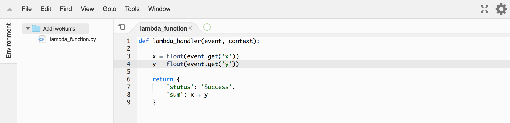
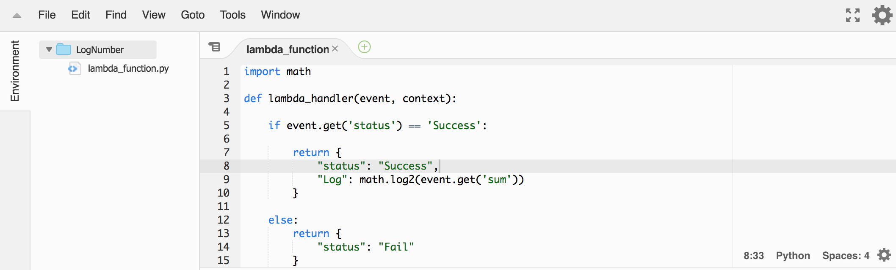
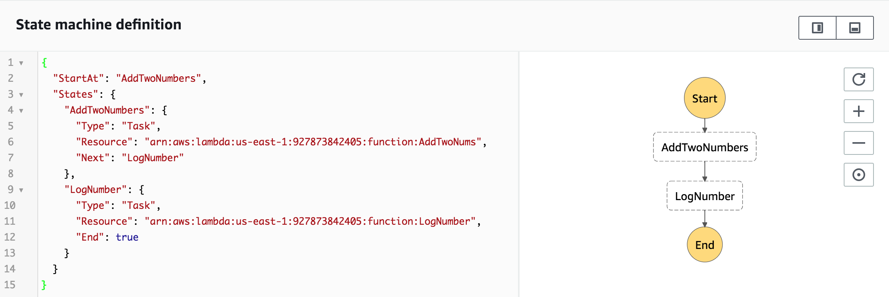
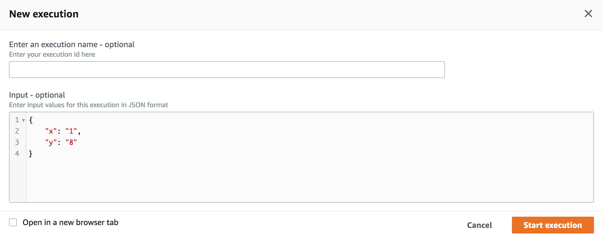
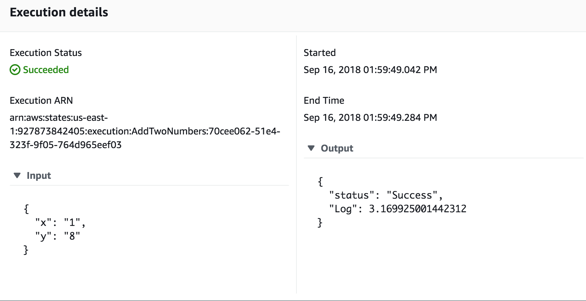
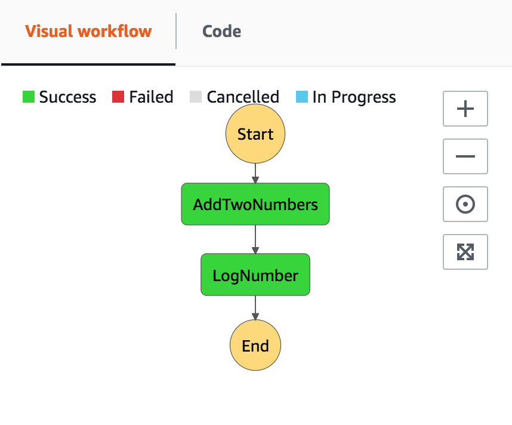

# AWS Step Functions
## Creating a lambda state machine

I'll take a simple example of creating an AWS Step Function using AWS lambda function to implement a task state. 

Step 1. Create a Lambda Function
     I have created an AWS lambda function previously. You can find it [here].(https://github.com/xd515/AWS_BuildingApi).
     
     

Step 2. Create a State Machine 
     1. Log in to the [Step Function Console](https://aws.amazon.com/cn/step-functions/?sc_channel=PS&sc_campaign=acquisition_USsc_publisher=google&sc_medium=ACQ-P%7CPS-GO%7CBrand%7CDesktop%7CSU%7CApplication%20Integration%7CStep%20Functions%7CUS%7CEN%7CText&sc_content=step_function_e&sc_detail=aws%20step%20function&sc_category=Application%20Integration&sc_segment=293643742238&sc_matchtype=e&sc_country=US&s_kwcid=AL!4422!3!293643742238!e!!g!!aws%20step%20function&ef_id=WLSGQwAAADwBkWOT:20180916165145:s) and choose to create a state machine.
     2. Select Author from Scratch and enter a name for your state machine.
     3. Create or enter a IAM role.
     4. In the State Machine Definition pane, according to the specification of wrting [ASL(Amazon States Language)](https://docs.aws.amazon.com/step-functions/latest/dg/concepts-amazon-states-language.html), add the states and resourses  using ARN of the Lambda Function created before.
     
     5. Update the workflow graph and create the state machine.

Step 3. Start a new excution
     1. On the page of AddTwoNums, choose start an excution.
     2. In the input area, type in the data with the following:
     
     3. Start the excution and view the results.
     
     
